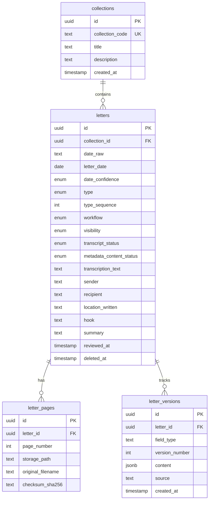

# Database Schema

## Overview

The application uses PostgreSQL with Drizzle ORM. The schema consists of four main tables: `collections`, `letters`, `letter_pages`, and `letter_versions`.

## Location

- Schema definition: `backend/src/db/schema.ts`
- Migrations: `backend/src/db/migrations/`
- Database connection: `backend/src/db/index.ts`

---

## Entity Relationship Diagram



---

## Tables

### collections

Organizes letters into named collections.

| Column | Type | Constraints | Description |
|--------|------|-------------|-------------|
| `id` | uuid | PK, default random | Primary key |
| `collection_code` | text | NOT NULL, UNIQUE | 3-digit code (e.g., "003") |
| `title` | text | | Display name |
| `description` | text | | Collection description |
| `created_at` | timestamptz | NOT NULL, default now | Creation timestamp |

---

### letters

Main content table storing letter metadata and processing state.

#### Identity Fields

| Column | Type | Constraints | Description |
|--------|------|-------------|-------------|
| `id` | uuid | PK, default random | Primary key |
| `collection_id` | uuid | FK → collections.id, NOT NULL | Parent collection |
| `date_raw` | text | NOT NULL | Raw date from filename (e.g., "18860314", "18XX0706") |
| `letter_date` | date | | Parsed ISO date (null if unknown) |
| `date_confidence` | enum | NOT NULL, default 'unknown' | 'exact', 'unknown', 'inferred' |
| `type` | enum | NOT NULL | Document type: L, P, E, V, A, D, C, N, T |
| `type_sequence` | int | NOT NULL, >= 1 | Sequence number for same date/type |

#### State Fields

| Column | Type | Constraints | Description |
|--------|------|-------------|-------------|
| `workflow` | enum | NOT NULL, default 'UPLOADED' | Legacy processing state |
| `visibility` | enum | NOT NULL, default 'HIDDEN' | Public visibility |

#### Two-Track Content Status (New)

Replaces single workflow with independent tracking of transcript and metadata verification.

| Column | Type | Constraints | Description |
|--------|------|-------------|-------------|
| `transcript_status` | enum | NOT NULL, default 'EMPTY' | EMPTY → AI_DRAFT → EDITED → VERIFIED |
| `metadata_content_status` | enum | NOT NULL, default 'EMPTY' | EMPTY → AI_DRAFT → EDITED → VERIFIED |
| `transcript_verified_at` | timestamptz | | When transcript was verified |
| `transcript_verified_by` | text | | Who verified transcript |
| `metadata_verified_at` | timestamptz | | When metadata was verified |
| `metadata_verified_by` | text | | Who verified metadata |

#### Transcription Fields

| Column | Type | Constraints | Description |
|--------|------|-------------|-------------|
| `transcription_status` | enum | NOT NULL, default 'PENDING' | Job status |
| `transcription_text` | text | | AI-generated transcript |
| `transcription_error` | text | | Last error message |
| `transcription_attempt_count` | int | NOT NULL, default 0, >= 0 | Retry counter |
| `transcribed_at` | timestamptz | | When transcription completed |
| `transcript_confirmed_at` | timestamptz | | When admin confirmed transcript |
| `transcript_confirmed_by` | text | | Who confirmed transcript |

#### Metadata Fields

| Column | Type | Constraints | Description |
|--------|------|-------------|-------------|
| `sender` | text | | Letter sender |
| `recipient` | text | | Letter recipient |
| `location_written` | text | | Where letter was written |
| `hook` | text | | One-line hook for browsing |
| `summary` | text | | Longer summary |
| `tags` | text[] | | Array of tags |
| `extracted_date` | date | | AI-inferred date |
| `extracted_date_confidence` | enum | | 'exact', 'unknown', 'inferred' |
| `metadata_json` | jsonb | | Raw AI extraction response |
| `metadata_status` | enum | NOT NULL, default 'PENDING' | Job status |
| `metadata_error` | text | | Last error message |
| `metadata_attempt_count` | int | NOT NULL, default 0, >= 0 | Retry counter |

#### Admin Fields

| Column | Type | Constraints | Description |
|--------|------|-------------|-------------|
| `reviewed_at` | timestamptz | | When admin reviewed |
| `reviewed_by` | text | | Who reviewed |
| `notes` | text | | Admin notes (not public) |

#### Soft Delete

| Column | Type | Constraints | Description |
|--------|------|-------------|-------------|
| `deleted_at` | timestamptz | | When soft deleted |
| `deleted_by` | text | | Who deleted |

#### Timestamps

| Column | Type | Constraints | Description |
|--------|------|-------------|-------------|
| `created_at` | timestamptz | NOT NULL, default now | Creation time |
| `updated_at` | timestamptz | NOT NULL, default now | Last update time |

---

### letter_pages

Stores individual page images for each letter.

| Column | Type | Constraints | Description |
|--------|------|-------------|-------------|
| `id` | uuid | PK, default random | Primary key |
| `letter_id` | uuid | FK → letters.id, NOT NULL, CASCADE | Parent letter |
| `page_number` | int | NOT NULL, >= 1 | Page sequence |
| `storage_path` | text | NOT NULL | Relative path to image file |
| `original_filename` | text | NOT NULL | Original uploaded filename |
| `checksum_sha256` | text | | File hash for deduplication |
| `created_at` | timestamptz | NOT NULL, default now | Creation time |
| `updated_at` | timestamptz | NOT NULL, default now | Last update time |

---

### letter_versions (New)

Stores version history for transcripts and metadata, enabling undo/restore functionality.

| Column | Type | Constraints | Description |
|--------|------|-------------|-------------|
| `id` | uuid | PK, default random | Primary key |
| `letter_id` | uuid | FK → letters.id, NOT NULL, CASCADE | Parent letter |
| `field_type` | text | NOT NULL, CHECK IN ('transcript', 'metadata') | Which field this version is for |
| `version_number` | int | NOT NULL, >= 1 | Sequential version number |
| `content` | jsonb | NOT NULL | { text: "..." } for transcript, { sender, recipient, ... } for metadata |
| `source` | text | NOT NULL, CHECK IN ('ai', 'human') | Who created this version |
| `created_at` | timestamptz | NOT NULL, default now | Creation time |

**Unique Constraint:** (letter_id, field_type, version_number)

---

## Enums

### letter_type

```sql
'L', 'P', 'E', 'V', 'A', 'D', 'C', 'N', 'T'
```
- L = Letter, P = Photo, E = Ephemera, V = Voice, A = Article
- D = Diary, C = Cover, N = Card, T = Telegram

### workflow_state (Legacy)

```sql
'UPLOADED', 'TRANSCRIBING', 'TRANSCRIBED',
'METADATA_EXTRACTING', 'METADATA_DRAFTED', 'REVIEWED'
```

**Note**: The `REVIEWED` state is deprecated. Letter completion is now determined by the two-track content status system (`transcript_status` and `metadata_content_status` both being `VERIFIED`).

### visibility_state

```sql
'PUBLISHED', 'HIDDEN'
```

### job_status

```sql
'PENDING', 'RUNNING', 'SUCCESS', 'FAILED'
```

### date_confidence

```sql
'exact', 'unknown', 'inferred'
```

### content_status (New)

```sql
'EMPTY', 'AI_DRAFT', 'EDITED', 'VERIFIED'
```
- EMPTY = No content yet
- AI_DRAFT = AI generated, human hasn't touched
- EDITED = Human has edited
- VERIFIED = Human explicitly marked as done

---

## Indexes

### letters

| Index | Columns | Purpose |
|-------|---------|---------|
| `letters_identity_unique` | (collection_id, date_raw, type, type_sequence) | Prevent duplicates |
| `idx_letters_collection` | (collection_id) | Filter by collection |
| `idx_letters_visibility` | (visibility) | Public queries |
| `idx_letters_workflow` | (workflow) | Processing queries |
| `idx_letters_letter_date` | (letter_date) | Date sorting |
| `idx_letters_extracted_date` | (extracted_date) | Date filtering |

### letter_pages

| Index | Columns | Purpose |
|-------|---------|---------|
| `letter_pages_unique` | (letter_id, page_number) | Prevent duplicate pages |
| `idx_pages_letter` | (letter_id) | Fetch pages for letter |

### letter_versions

| Index | Columns | Purpose |
|-------|---------|---------|
| `letter_versions_unique` | (letter_id, field_type, version_number) | Prevent duplicate versions |
| `idx_versions_letter` | (letter_id) | Fetch versions for letter |

---

## Constraints

### Check Constraints

```sql
-- Published letters must be reviewed
CHECK (visibility <> 'PUBLISHED' OR reviewed_at IS NOT NULL)

-- Type sequence must be positive
CHECK (type_sequence >= 1)

-- Page number must be positive
CHECK (page_number >= 1)

-- Attempt counts must be non-negative
CHECK (transcription_attempt_count >= 0)
CHECK (metadata_attempt_count >= 0)
```

### Foreign Keys

```sql
-- Letters belong to a collection (restrict delete)
letters.collection_id → collections.id ON DELETE RESTRICT

-- Pages belong to a letter (cascade delete)
letter_pages.letter_id → letters.id ON DELETE CASCADE

-- Versions belong to a letter (cascade delete)
letter_versions.letter_id → letters.id ON DELETE CASCADE
```

---

## Drizzle Relations

```typescript
// Collection has many letters
collectionsRelations = relations(collections, ({ many }) => ({
  letters: many(letters),
}));

// Letter belongs to collection, has many pages and versions
lettersRelations = relations(letters, ({ one, many }) => ({
  collection: one(collections, {
    fields: [letters.collectionId],
    references: [collections.id],
  }),
  pages: many(letterPages),
  versions: many(letterVersions),
}));

// Page belongs to letter
letterPagesRelations = relations(letterPages, ({ one }) => ({
  letter: one(letters, {
    fields: [letterPages.letterId],
    references: [letters.id],
  }),
}));

// Version belongs to letter
letterVersionsRelations = relations(letterVersions, ({ one }) => ({
  letter: one(letters, {
    fields: [letterVersions.letterId],
    references: [letters.id],
  }),
}));
```

---

## Common Queries

### Fetch letter with pages and collection

```typescript
const letter = await db.query.letters.findFirst({
  where: eq(letters.id, letterId),
  with: {
    collection: true,
    pages: {
      orderBy: (p, { asc }) => [asc(p.pageNumber)],
    },
  },
});
```

### Find related items (same date/sequence)

```typescript
const related = await db.query.letters.findMany({
  where: and(
    eq(letters.collectionId, letter.collectionId),
    eq(letters.dateRaw, letter.dateRaw),
    eq(letters.typeSequence, letter.typeSequence),
    sql`${letters.type} != ${letter.type}`,
    isNull(letters.deletedAt)
  ),
});
```

### Filter published letters

```typescript
const published = await db.query.letters.findMany({
  where: and(
    eq(letters.visibility, 'PUBLISHED'),
    isNull(letters.deletedAt)
  ),
});
```

---

## Migration Commands

```bash
# Generate migration from schema changes
cd backend && npm run db:generate

# Push schema to database (dev only)
cd backend && npm run db:push

# Run migrations (production)
cd backend && npm run db:migrate
```

---

## Related Docs

- [processing-pipeline.md](processing-pipeline.md) - How workflow states change
- [api-contracts.md](api-contracts.md) - How data is exposed via API
- [filename-conventions.md](filename-conventions.md) - How identity fields are derived
