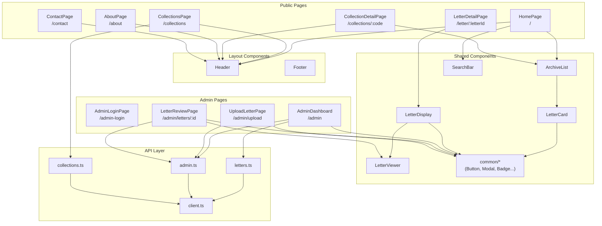

# Frontend Architecture

## Overview

The frontend is a React + TypeScript application built with Vite. It uses React Router for navigation and has two main areas: public letter browsing and admin management.

## Location

- Router config: `frontend/src/App.tsx`
- Pages: `frontend/src/pages/`
- Components: `frontend/src/components/`
- API layer: `frontend/src/api/`
- Types: `frontend/src/types/`

---

## Architecture Diagram



---

## Route Structure

### Public Routes (with Header)

| Route | Page | Purpose |
|-------|------|---------|
| `/` | HomePage | Browse all published letters |
| `/about` | AboutPage | About the project |
| `/contact` | ContactPage | Contact information |
| `/collections` | CollectionsPage | List all collections |
| `/collections/:code` | CollectionDetailPage | Letters in a collection |

### Standalone Routes (no Header)

| Route | Page | Purpose |
|-------|------|---------|
| `/letter/:letterId` | LetterDetailPage | View a single letter (public) |

### Admin Routes (no Header)

| Route | Page | Purpose |
|-------|------|---------|
| `/admin-login` | AdminLoginPage | Admin authentication |
| `/admin` | AdminDashboard | Letter management table |
| `/admin/upload` | UploadLetterPage | Upload new letters |
| `/admin/letters/:id` | LetterReviewPage | Edit letter details |

---

## Page Details

### HomePage

**File**: `pages/HomePage.tsx`

**Purpose**: Browse and search published letters

**Components Used**:
- `SearchBar` - Query input and filters
- `ArchiveList` - Paginated letter grid
- `LetterCard` - Individual letter preview

**API Calls**:
- `getPublishedLetters()` from `api/letters.ts`

**Key State**:
- `searchQuery` - Search text
- `filters` - Active filters (date, collection)

---

### LetterDetailPage

**File**: `pages/LetterDetailPage.tsx`

**Purpose**: Read a single published letter

**Components Used**:
- `LetterDisplay` - Full letter view with metadata
- `LetterViewer` - Image carousel

**API Calls**:
- `getLetterById(letterId)` from `api/letters.ts`

**Notes**:
- Has its own back button (no global header)
- Shows transcript, metadata, images

---

### AdminDashboard

**File**: `pages/admin/AdminDashboard.tsx`

**Purpose**: Manage all letters (any state)

**Components Used**:
- `Button`, `ConfirmDialog` from common
- `WorkflowBadge`, `VisibilityBadge`
- `DropdownHeader`, `DropdownItem`

**API Calls**:
- `getAdminLetters()` - List with filters
- `deleteLetter()` - Delete selected
- `startTranscription()`, `startMetadataExtraction()` - AI processing
- `getProcessingStatus()` - Poll progress
- `bulkResetTranscriptions()`, `bulkClearMetadata()` - Bulk actions

**Key State**:
- `letters` - Current letter list
- `editMode` - Selection mode active
- `selectedIds` - Selected letter IDs
- `processingStatus` - Background job progress
- Filter states (visibility, workflow, collection, search)

**Special Features**:
- Multi-column sorting (click headers)
- Drag selection in edit mode
- Persisted filters (localStorage)

---

### UploadLetterPage

**File**: `pages/admin/UploadLetterPage.tsx` (~1500 lines)

**Purpose**: Upload and organize letter images

**Components Used**:
- `Button`, `ConfirmDialog` from common
- `TypeBadge` for document types
- Custom lightbox, carousel, collection modal

**API Calls**:
- `uploadFiles()` from `api/admin.ts`
- `getCollections()` from `api/collections.ts`

**Key State**:
- `files` - Uploaded files with parsed metadata
- `collections` - Grouped by collection code
- `editMode` - Reorganization mode
- `selectedCollection` - Active collection for viewing
- `lightboxImage` - Full-screen image view

**Special Features**:
- Filename parsing (extracts collection, date, type)
- Duplicate detection
- Batch upload with progress
- Collection-based organization

---

### LetterReviewPage

**File**: `pages/admin/LetterReviewPage.tsx` (~600 lines)

**Purpose**: Edit letter transcript and metadata

**Components Used**:
- `Button`, `IconButton` from common
- `WorkflowBadge`, `StatusBadge`
- `LetterViewer` - Image viewer

**API Calls**:
- `getAdminLetterById()` - Load letter
- `updateLetter()` - Save changes
- `confirmTranscript()` - Trigger metadata extraction
- `markAsReviewed()` - Mark complete
- `deleteLetter()` - Delete

**Key State**:
- `letter` - Current letter data
- `transcript` - Editable text
- Form fields (sender, recipient, date, etc.)
- `saving` - Save in progress

**Special Features**:
- Contenteditable transcript editor
- Auto-resize textareas for metadata
- Dynamic font sizing (prevents overflow)
- Workflow-dependent button visibility

---

## Component Hierarchy

```
App
├── Header (public routes only)
├── ScrollToTop
└── Routes
    ├── Public Pages
    │   ├── HomePage
    │   │   ├── SearchBar
    │   │   └── ArchiveList
    │   │       └── LetterCard (×N)
    │   ├── LetterDetailPage
    │   │   └── LetterDisplay
    │   │       └── LetterViewer
    │   ├── CollectionsPage
    │   └── CollectionDetailPage
    │       └── ArchiveList
    │
    └── Admin Pages
        ├── AdminLoginPage
        ├── AdminDashboard
        │   ├── Button, ConfirmDialog
        │   ├── WorkflowBadge, VisibilityBadge
        │   └── DropdownItem (×N)
        ├── UploadLetterPage
        │   ├── Button, ConfirmDialog
        │   ├── TypeBadge
        │   └── Custom lightbox/carousel
        └── LetterReviewPage
            ├── Button, IconButton
            ├── WorkflowBadge, StatusBadge
            └── LetterViewer
```

---

## API Layer

### Structure

```
frontend/src/api/
├── client.ts       # Base HTTP client
├── letters.ts      # Public letter endpoints
├── admin.ts        # Admin endpoints
└── collections.ts  # Collection endpoints
```

### Client Pattern

All API calls use the base client from `client.ts`:

```tsx
// client.ts
export async function apiGet<T>(path: string): Promise<T> {
  const response = await fetch(`${API_URL}${path}`);
  if (!response.ok) throw new Error(await response.text());
  return response.json();
}
```

### Usage Example

```tsx
// letters.ts
export async function getPublishedLetters(options?: {
  page?: number;
  limit?: number;
  collection?: string;
}): Promise<LetterListResponse> {
  const params = new URLSearchParams();
  if (options?.page) params.append('page', String(options.page));
  // ...
  return apiGet(`/letters?${params}`);
}
```

---

## State Management

**Pattern**: Local component state with `useState`

**Global state**: Only `ToastContext` for notifications

```tsx
// ToastContext usage
const { showToast } = useToast();
showToast('Letter saved', 'success');
showToast('Failed to save', 'error');
```

**No Redux/Zustand** - state is page-local, passed down as props.

---

## Related Docs

- [reusable-components.md](reusable-components.md) - Common component details
- [api-contracts.md](api-contracts.md) - API endpoint reference
