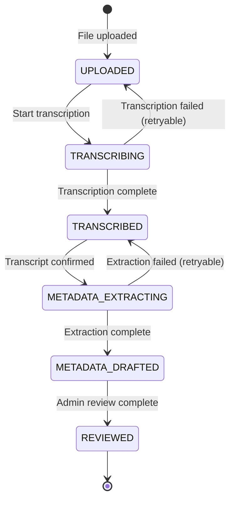

# Processing Pipeline

## Overview

Letters go through a multi-stage AI processing pipeline for transcription and metadata extraction. The pipeline is designed to be resumable with human verification gates.

## Location

- Pipeline orchestration: `backend/src/pipeline/processor.ts`
- Transcription: `backend/src/pipeline/transcription.ts`
- Metadata extraction: `backend/src/pipeline/metadata.ts`
- AI integration: `backend/src/ai/openai.ts`
- Admin routes: `backend/src/routes/admin/letters.ts`

---

## Workflow States



| State | Description |
|-------|-------------|
| `UPLOADED` | Initial state after file upload |
| `TRANSCRIBING` | AI transcription in progress |
| `TRANSCRIBED` | Transcription complete, awaiting confirmation |
| `METADATA_EXTRACTING` | AI metadata extraction in progress |
| `METADATA_DRAFTED` | Metadata extracted, awaiting review |
| `REVIEWED` | Admin has reviewed and approved |

---

## Visibility States

Separate from workflow, controls public visibility:

| State | Description |
|-------|-------------|
| `DRAFT` | Not publicly visible (default) |
| `PUBLISHED` | Visible on public site |
| `HIDDEN` | Explicitly hidden from public |

**Constraint**: `PUBLISHED` requires `reviewedAt` to be set.

---

## Processing Phases

### Phase 1: Transcription

**Trigger**: Letter in `UPLOADED` state with `transcriptionStatus='PENDING'`

**Process**:
1. Set `workflow='TRANSCRIBING'`, `transcriptionStatus='RUNNING'`
2. Load all pages for the letter
3. For each page, call OpenAI Vision API to transcribe handwriting
4. Combine page transcriptions with `--- Page N ---` separators
5. Set `transcriptionStatus='SUCCESS'`, `workflow='TRANSCRIBED'`
6. Store transcription in `transcriptionText` field

**On Failure**:
- Set `transcriptionStatus='FAILED'`, record error
- Workflow stays at `TRANSCRIBING` (allows retry)
- Max 3 attempts before permanent failure

**Human Gate**: Admin must confirm transcript before metadata extraction.

---

### Phase 2: Metadata Extraction

**Trigger**: Letter in `TRANSCRIBED` state with `transcriptConfirmedAt` set and `metadataStatus='PENDING'`

**Process**:
1. Set `workflow='METADATA_EXTRACTING'`, `metadataStatus='RUNNING'`
2. Send transcription to OpenAI for structured extraction
3. Extract: sender, recipient, location, hook, summary, tags, date
4. Set `metadataStatus='SUCCESS'`, `workflow='METADATA_DRAFTED'`
5. Store extracted fields in respective columns

**On Failure**:
- Set `metadataStatus='FAILED'`, record error
- Workflow stays at `METADATA_EXTRACTING` (allows retry)
- Max 3 attempts before permanent failure

---

## Job Status Tracking

Each phase has its own status field:

| Field | Values | Purpose |
|-------|--------|---------|
| `transcriptionStatus` | PENDING, RUNNING, SUCCESS, FAILED | Tracks transcription job |
| `metadataStatus` | PENDING, RUNNING, SUCCESS, FAILED | Tracks metadata job |

Attempt counts prevent infinite retries:
- `transcriptionAttemptCount` - Max 3 attempts
- `metadataAttemptCount` - Max 3 attempts

---

## Transcript Confirmation Gate

Metadata extraction requires explicit admin confirmation:

1. Admin reviews AI-generated transcription
2. Makes any corrections needed
3. Clicks "Confirm Transcript" button
4. Sets `transcriptConfirmedAt` and `transcriptConfirmedBy`
5. Sets `metadataStatus='PENDING'` to queue for extraction

This ensures transcript quality before deriving metadata.

---

## Batch Processing

Admin can trigger batch processing from the dashboard:

### Start Transcription
```
POST /admin/processing/start-transcription
Body: { collectionCode?: "003" }
```
- Finds all L-type letters with `workflow='UPLOADED'` and at least one page
- Optionally filters by collection
- Processes sequentially in background

### Start Metadata Extraction
```
POST /admin/processing/start-metadata
Body: { collectionCode?: "003" }
```
- Finds all L-type letters with `workflow='TRANSCRIBED'` and confirmed transcript
- Optionally filters by collection
- Processes sequentially in background

### Processing Controls
```
POST /admin/processing/pause    # Pause current batch
POST /admin/processing/resume   # Resume paused batch
POST /admin/processing/abort    # Abort and revert current job
GET /admin/processing/status    # Get current progress
```

---

## Reset Operations

### Reset Transcriptions
```
POST /admin/letters/bulk/reset-transcriptions
```
- Sets `workflow='UPLOADED'`
- Clears `transcriptionText`, `transcriptConfirmedAt`
- Clears all metadata fields
- Resets `transcriptionStatus='PENDING'`

Use when: Re-testing with updated AI prompts, or starting over.

### Clear Metadata Only
```
POST /admin/letters/bulk/clear-metadata
```
- Sets `workflow='TRANSCRIBED'`
- Clears metadata fields (sender, recipient, etc.)
- Keeps transcription intact
- Resets `metadataStatus='PENDING'`

Use when: Re-extracting metadata with new prompts while keeping transcription.

---

## Type Restrictions

**Only L-type (Letter) documents are processed.** Other types (C, E, P, etc.) are:
- Stored as related items
- Displayed alongside the primary letter
- Not independently transcribed or extracted

---

## Error Handling

### Transient Errors
- Network timeouts, API rate limits
- Workflow stays in *-ING state
- Retried up to 3 times

### Permanent Errors
- Max attempts exceeded
- Status set to `FAILED`
- Error message stored in `transcriptionError` or `metadataError`
- Admin can manually reset to retry

### Abort Handling
When processing is aborted:
1. Current job's status reverted to initial state
2. Processing stops after current job
3. Completed jobs remain completed

---

## Monitoring

Processing status includes:
```json
{
  "isRunning": true,
  "isPaused": false,
  "shouldAbort": false,
  "currentJob": { "letterId": "...", "type": "transcription" },
  "completed": 5,
  "failed": 1,
  "total": 20,
  "errors": ["uuid: Error message"],
  "lastCompletedAt": 1699999999999
}
```

Frontend polls `/admin/processing/status` to show live progress.

---

## Related Docs

- [api-contracts.md](api-contracts.md) - Processing API endpoints
- [database-schema.md](database-schema.md) - Status and workflow fields
- [filename-conventions.md](filename-conventions.md) - How files are parsed on upload
