# Voices That Remain

A full-stack platform that turns boxes of handwritten historical letters into a searchable, browsable digital archive. AI handles transcription and metadata extraction; humans verify and curate.

**[voicesthatremain.com](https://voicesthatremain.com)**


> _"A letter always feels to me like immortality, because it is the mind alone without corporeal friend."_
> — Emily Dickinson, in a letter to T. W. Higginson, June 1869

---

The public site is only half the project. The interesting half is the admin system behind it — the place where scanned images become structured archive entries, where AI drafts get verified by a human, where collections are curated, and where every cent of OpenAI spend is tracked back to the letter that triggered it. Most of this README focuses there.

---

## The Public Side — what's behind the screens

A visitor can browse the site themselves; the more interesting question is what's powering each page that they'd never notice from the outside. Each shot below is paired with a note about the engineering underneath, not the UX on top.

### Archive-wide search

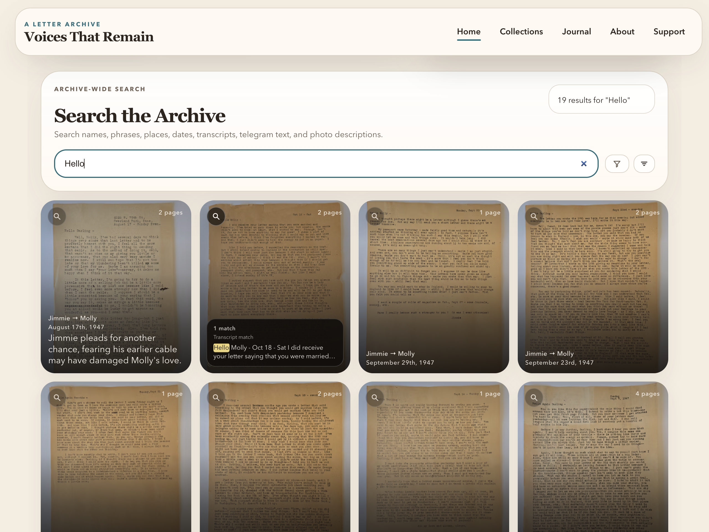

Looks like a single search box, but the query is a hybrid. `websearch_to_tsquery()` handles phrase intent and quotation grouping, a trigram `similarity()` filter (threshold 0.22) catches fuzzy name spellings ("Jimmie" vs "Jimmy"), and a contiguous-phrase boost re-ranks hits where words appear near each other. The whole thing is one CTE that gets evaluated *twice in parallel* — once to produce result rows, once to produce facet counts — so the expensive scan only runs once per request. Results are LRU-cached server-side for 10 s (50 entries). The client debounces input 180 ms and syncs query state to both the URL and localStorage so refreshing the page or sharing a link round-trips the exact same search. Code: [`backend/src/routes/letters.ts:836`](backend/src/routes/letters.ts) (`searchArchiveSummaries`), [`frontend/src/hooks/useArchiveSearch.ts`](frontend/src/hooks/useArchiveSearch.ts).

### Collection page

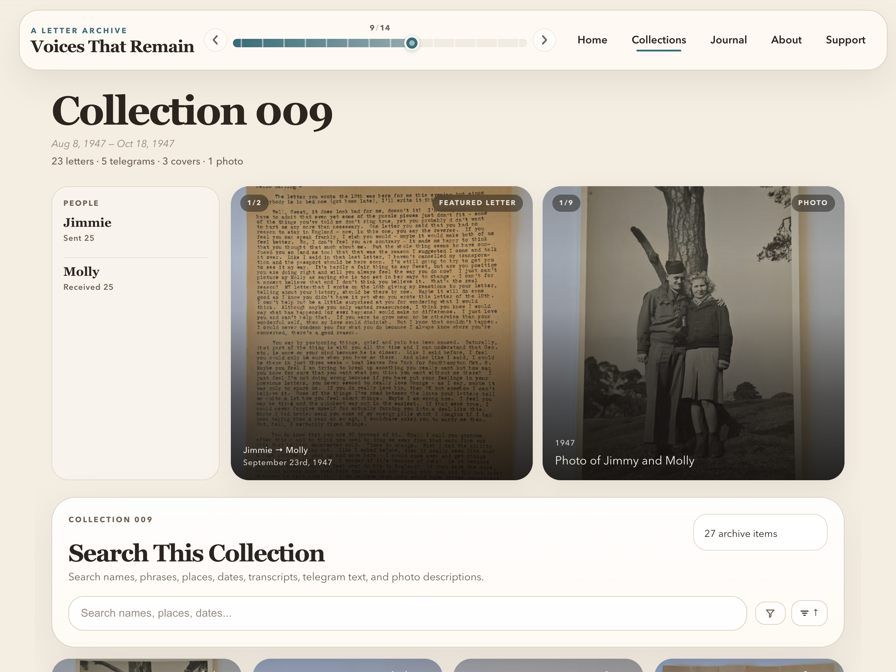

The "Search This Collection" box is not a separate component — it's literally the same `useArchiveSearch` hook the archive-wide search uses, just with the `collection` filter pre-pinned. One code path, two surfaces. The collection profile (hook, narrative, correspondents list) loads from a separate `GET /collections/:code/profile` endpoint so the rest of the page can render before the AI-generated narrative comes back. Code: [`frontend/src/pages/CollectionDetailPage.tsx`](frontend/src/pages/CollectionDetailPage.tsx), [`collection-detail-utils.ts`](frontend/src/pages/collection-detail-utils.ts).

### Letter detail

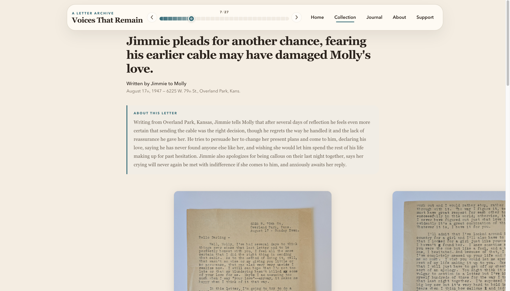

Companion documents (covers, envelopes, telegrams, ephemera) are grouped onto the same letter page by matching `(date, typeSequence)` tuples — that's the entire purpose of the `T` / `C` / `E` codes in the filename convention (`{collection}-{date}-{type}{seq}-{page}.ext`, parsed by [`services/filename-parser.ts:1`](backend/src/services/filename-parser.ts)). The DTO layer runs `stripUnpublishedContent()` per-field, so a letter can be public-visible with its hook live but its full transcript still hidden behind verification. The hook on this page is the same string stored in the database, but the guillemet identity tags (`«SENDER:Jimmie»`) are stripped on the way out and replaced with linked person chips in the renderer. Code: [`backend/src/routes/letters.ts:548`](backend/src/routes/letters.ts), [`backend/src/dto/letter.dto.ts:406`](backend/src/dto/letter.dto.ts) (`extractTaggedField`).

### Reading-mode transcript

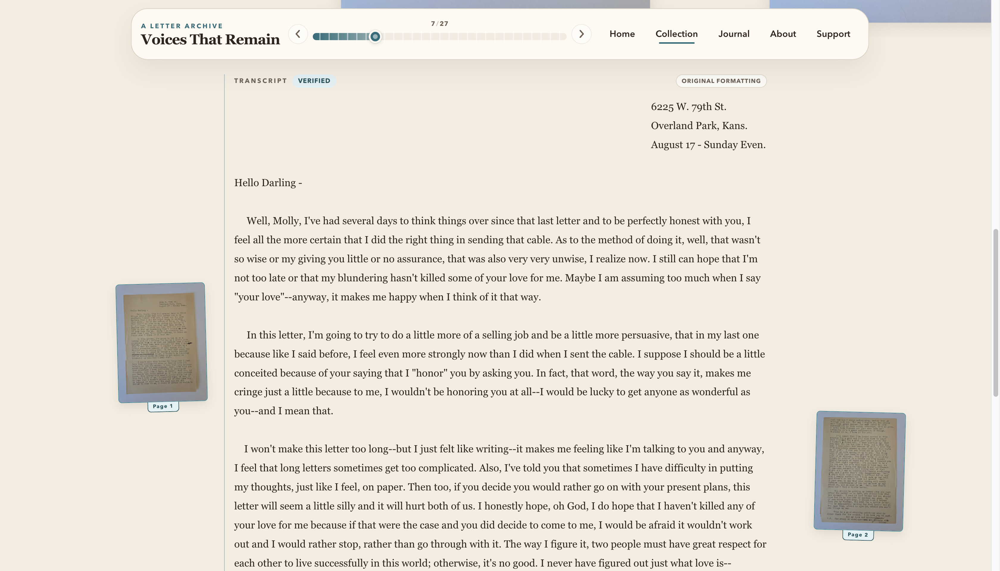

When a transcript is verified, the backend pre-computes a `readingText` field — the typeset reading layout you see here. The public reader never re-flows from raw transcribed text on every request. The renderer prefers `transcript.structuredPages` (a JSON structure with paragraph and page boundaries the AI emits) and falls back to splitting the plain `transcriptionText` on page markers if structured output isn't available. Code: [`backend/src/dto/letter.dto.ts:479`](backend/src/dto/letter.dto.ts).

### Sharing & SEO


The site is a Vite-built SPA — there's no SSR — but it still gets per-route metadata so each letter, collection, and Journal post unfurls into its own preview when shared. Three pieces make that work:

- **Custom `<SEO />` component** ([`frontend/src/components/SEO.tsx`](frontend/src/components/SEO.tsx)) that imperatively mutates the document head on route mount. Each page declares its own `title`, `description`, `ogTitle` / `ogDescription` / `ogImage` / `imageAlt`, `canonicalUrl`, `robots`, `publishedTime` / `modifiedTime`, and an optional `jsonLd` object (or array) for structured data. Twitter card type auto-switches between `summary_large_image` and `summary` based on whether an OG image is provided; canonical hrefs and `<script type="application/ld+json">` blobs are mounted and torn down with the route.
- **Dynamic sitemap** at `GET /sitemap.xml` ([`backend/src/routes/sitemap.ts`](backend/src/routes/sitemap.ts)). Five parallel queries enumerate every published letter, collection-with-letters, journal post, canonical person, and canonical place — joined to `letters.updatedAt` so each entry's `<lastmod>` reflects real activity. Static pages (`/`, `/about`, `/support`, `/collections`, `/blog`) ship with hand-tuned `changefreq` / `priority`.
- **Defaults in `index.html`** ([`frontend/index.html`](frontend/index.html)) — fallback Open Graph and Twitter Card metadata for routes that don't override (`og-default.png` at 1200×630), the full favicon set (16×16, 32×32, `favicon.ico`, 180×180 apple-touch-icon), and `robots.txt` that disallows `/admin` and `/admin-login` while pointing crawlers at the sitemap.

Net effect: every public surface is indexable with rich snippets, and link previews don't fall back to a generic site card.

That's the surface. Everything below is the system the archivist drives.

---

## The Admin Side

The admin is a single-page application reached at `/admin`, gated by JWT auth. The sidebar covers the full lifecycle — Dashboard, Content, Processing, Notes, Usage, Upload, Notifications, Settings — in one tool: ingest, AI processing, human verification, curation, and publication.

### 1. The letter dashboard — the archivist's workbench

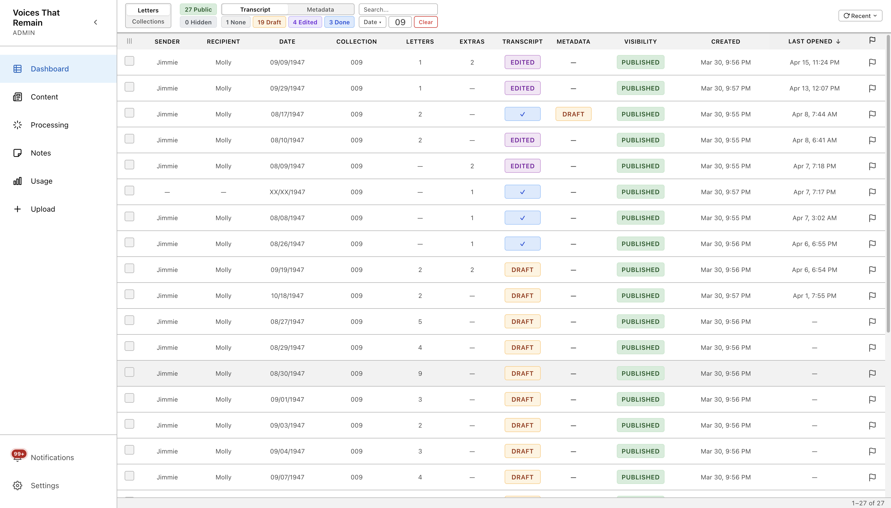

This is the home base. Every letter the system has ever ingested shows up here as a row, and every column is a piece of state that matters.

- **Sender / Recipient / Date / Collection** — denormalized from the verified metadata so the table can be sorted and filtered without N+1 lookups.
- **Letters** — page count for the document.
- **Transcript / Metadata pills** — the two-track verification status (`EMPTY · AI_DRAFT · EDITED · VERIFIED`). They advance independently. A letter can have a verified transcript but a draft metadata extraction, or vice versa.
- **Visibility** — `PUBLISHED` / `HIDDEN`, decoupled from verification. You can hide a verified letter and you can publish a draft one (e.g. for review).
- **Last opened** — the freshness signal.

Header chip filters (`27 Public · 3 Notes · 19 Draft · 4 Edited · 3 Done`) and column visibility both persist to localStorage. Column state uses a `{ visible, known }` shape — the `known` set is the trick: when a new default column is added in code, it auto-shows for users who've never seen it before, *without* clobbering anyone who explicitly hid it. Filter, sort, and column state each live in their own hook ([`useDashboardColumns`](frontend/src/pages/admin/AdminDashboard/useDashboardColumns.ts), [`useDashboardFilters`](frontend/src/pages/admin/AdminDashboard/useDashboardFilters.ts), [`useDashboardSort`](frontend/src/pages/admin/AdminDashboard/useDashboardSort.ts)) so each tests independently.

Selecting a row opens the per-letter editor.

### 2. Per-letter editor — where AI drafts become archive entries

The per-letter editor has two main views, sharing the same image viewer on the left:

#### Transcript view

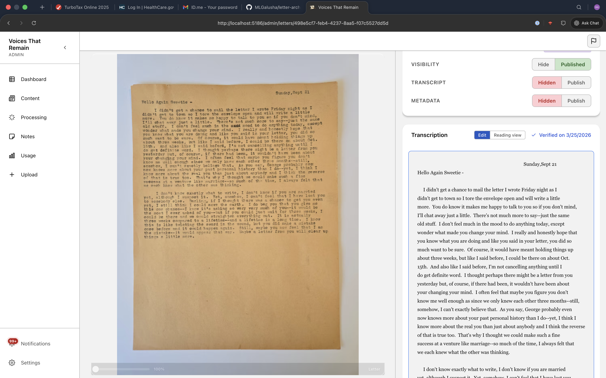

The right rail holds the full transcribed text in an editable view ([`TranscriptionSection.tsx`](frontend/src/pages/admin/LetterReview/TranscriptionSection.tsx)), with a `Reading view` toggle to preview how the public will see it and a `Verified on …` stamp when it's signed off. The Visibility / Transcript / Metadata pills at the top stay put across both tabs of the editor, so verification state is always visible no matter which view you're in. Edits write a new row to `letter_versions`, so the AI's first draft is never lost — you can always diff against it. On verify, the backend regenerates the public `readingText` field from the canonical transcript, which is what the public reading mode renders from (no live recomputation per request).

#### Metadata view

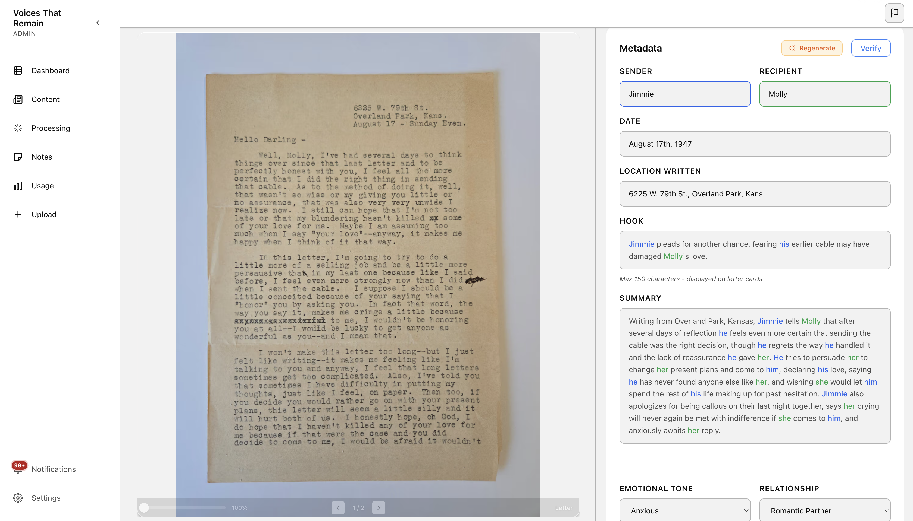

Same letter, different tab. Original images on the left, structured metadata on the right. The right rail isn't a free-text form — every field is backed by a Zod schema and, for AI drafts, came out of an OpenAI structured-output call.

- **Sender / Recipient** are linked to the canonical persons registry. Typing a name autocompletes against existing entities; if you type a new one, it goes into the entity review queue.
- **Date / Location written** are parsed and normalized — dates support partial precision (just a year, just a month).
- **Hook** is the one-sentence narrative the public site shows above the transcript. Identity references inside it are tagged with guillemets (`«SENDER:Jimmie»`) so they stay correctly linked even after a person is renamed or merged.
- **Summary** is a longer, plain-language paragraph for visitors who don't want to read 86 lines of transcribed handwriting.
- **Emotional tone** and **Relationship** are constrained enums enforced at the model layer, not free text — this is what keeps the public-facing tone tags consistent across hundreds of letters.

The header pill controls — Hide / Published, Hidden / Publish for transcript and metadata — are the levers for the two-track verification flow. Verifying transcript and metadata are independent operations and each generates its own audit trail entry. The four states are a Postgres enum (`contentStatusEnum = ['EMPTY', 'AI_DRAFT', 'EDITED', 'VERIFIED']` in [`db/schema.ts:94`](backend/src/db/schema.ts)) applied independently to `transcriptStatus` and `metadataContentStatus`. The form itself is wired through [`useMetadataEditing`](frontend/src/pages/admin/LetterReview/useMetadataEditing.ts), which double-buffers the AI's tagged version of free-text fields (`taggedHook`, `taggedDescription`) so identity references survive a person rename — and double-clicking a verified field unverifies it, the inverse of the verify button.

#### Lightbox viewer

Clicking any page image opens a full-screen lightbox — the same component the public site uses, but it's the archivist's main verification tool. Two views matter here:

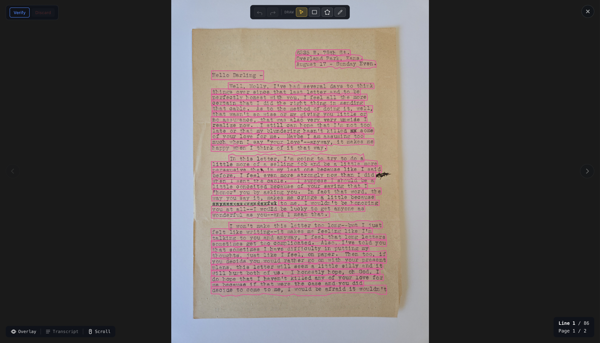

**Overlay mode.** Every transcribed line is mapped to its bounding box on the original scan and rendered as a pink highlight on top of the image. The bounding boxes come from a Python computer-vision subprocess ([`python/line_finder.py`](python/line_finder.py), invoked via [`backend/src/services/line-finder.ts`](backend/src/services/line-finder.ts)) that runs horizontal projection profiling — classical CV, not deep learning — and stores the result as JSON in `letter_pages.lineSegments`. Those boxes are then reconciled against the GPT vision transcript so each AI-transcribed line knows where it lives on the page. As the archivist scrolls the transcript on the right, the corresponding region lights up on the left — and conversely, clicking a region scrolls the transcript. This is how transcript verification actually happens — you don't read the AI draft and the page separately, you read them registered to each other and catch misreads instantly. Toggles at the bottom-left switch between **Overlay**, **Segments**, and **Scroll** modes; segments mode shows trust state per line (unverified / human-reviewed / AI-confidence). Code: [`components/LineReviewMode/LineReviewMode.tsx`](frontend/src/components/LineReviewMode/LineReviewMode.tsx).

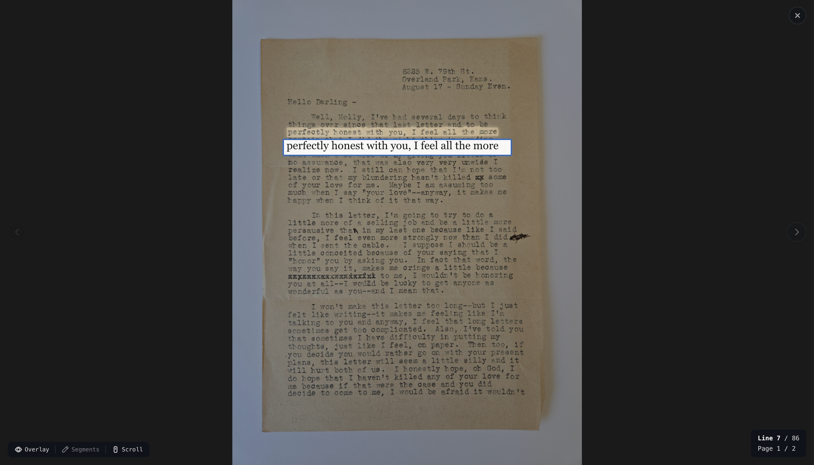

**Search-result mode.** Opening a search hit (from the dashboard or anywhere else) drops you into the lightbox already scrolled to the matching line, with the matched phrase rendered as a labeled callout on the page itself. The line counter in the corner (`Line 7 / 86`, `Page 1 / 2`) tells you exactly where you are in a long letter — useful when the same phrase appears multiple times.

### 3. Processing — the live pipeline

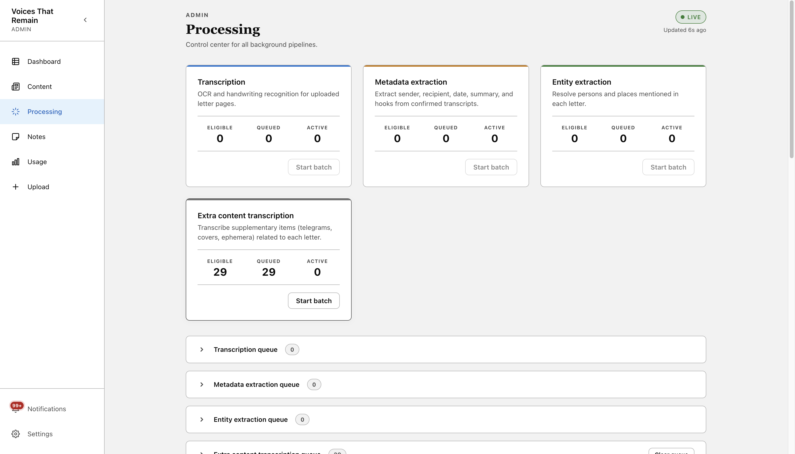

This is the control center for the worker. (The worker itself is a Cloud Run Job fired on demand — see Architecture below.)

Each card is a pipeline stage:

- **Transcription** — vision model reads handwritten text from each page image. Multi-page letters are transcribed page-by-page and concatenated.
- **Metadata extraction** — structured-output model returns dates, sender / recipient, summary, hook, emotional tone, topics, relationship type. JSON-schema validated.
- **Entity extraction** — extracts mentioned people and places from the transcript and matches them against the canonical registries, queueing new candidates for review.
- **Extra content transcription** — telegrams, envelopes, covers, ephemera. Separately gated because not every supplementary scan contains transcribable text.

Each stage shows three counts — **eligible / queued / active** — and a `Start batch` button. "Eligible" means the letter is in a state that _could_ enter this stage; "queued" means a job has been written; "active" means the worker has it. The Extra-content card showing `29 eligible / 29 queued / 0 active` in the screenshot means a batch was just dispatched and the worker hasn't started picking it up yet.

The collapsing queues underneath each card list every job individually with the letter ID, attempt count, and last error — useful when one of the 29 starts failing.

The dashboard isn't polled on a fixed interval. It subscribes to the admin notifications SSE stream (`GET /admin/notifications/stream`, gated by a one-time token) and updates as the worker pushes state diffs; periodic polling is the fallback if the stream drops. The page state is owned by [`useProcessingState`](frontend/src/hooks/useProcessingState.ts); orchestration lives in [`services/processing-queue.ts`](backend/src/services/processing-queue.ts). The eligible / queued / active counts are derived client-side from the three arrays the API returns (`ActiveBatchState`, `QueuedItem[]`, `RecentJob[]`) — the backend doesn't precompute them.

### 4. Usage & analytics — cost attribution at the letter level

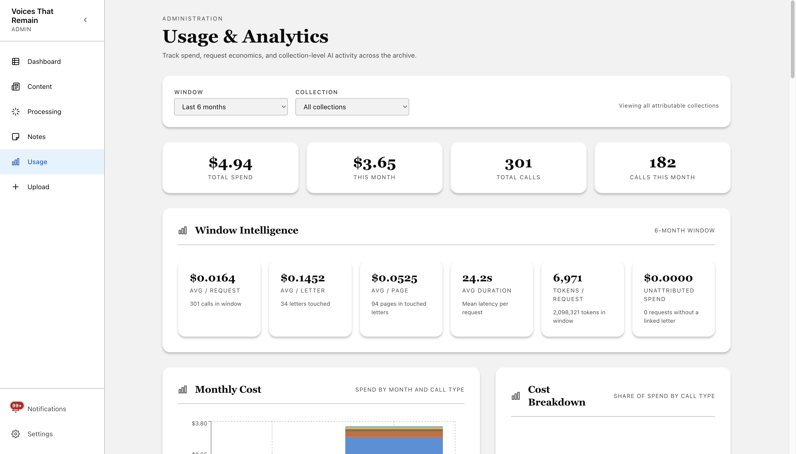

Every OpenAI call is logged into `api_usage_logs` with the letter ID, call type, prompt and completion token counts, model, and latency. Nothing about this dashboard is computed from a third-party billing export — it's all our own data, joined to the letter table.

- **$0.0164 / request** and **$0.1452 / letter** are the numbers I actually care about as the operator: do I have a regression where the metadata extraction prompt suddenly costs 3x what it used to?
- **$0.0525 / page** lets me reason about scaling: a new collection of 200 pages will cost ~$10 to process end-to-end.
- **Unattributed spend** is the integrity check. Any OpenAI call that goes out _without_ being tagged to a letter shows up here. The goal is zero. If it's not zero, something in the code is calling the API without using the wrapped client.

The wrapper is [`services/usage-tracking.ts`](backend/src/services/usage-tracking.ts) — every OpenAI request goes through `logApiUsage()`, which writes a row to `api_usage_logs` with `inputTokens`, `outputTokens`, model, latency, the call type (`transcription` / `metadata_v2` / `entity_extraction` / `collection_profile` / …), and the `letterId` that triggered it. The dashboard queries [`routes/admin/usage.ts`](backend/src/routes/admin/usage.ts) (`/admin/usage/summary`, `/analytics`, `/calls`) and the cards are normal SQL aggregations, not a separate analytics pipeline.

#### Time-series breakdowns

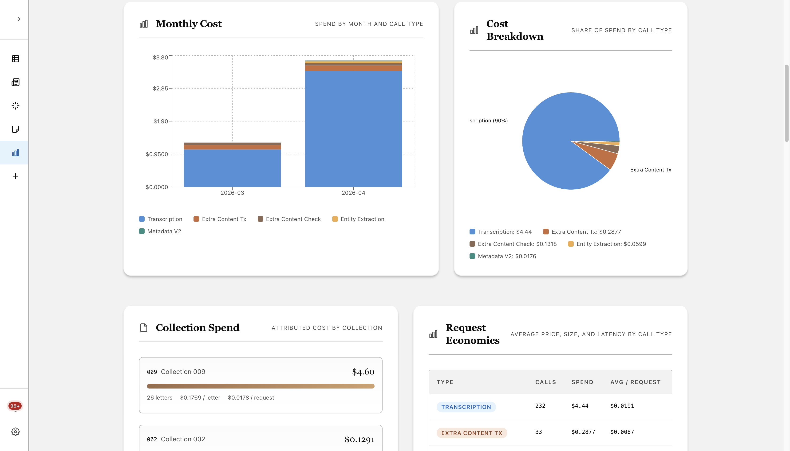

Below the headline cards: a monthly stacked bar chart of spend by call type, a share-of-spend pie, a per-collection attribution table (Collection 009 cost $4.60 — 26 letters · $0.1769/letter · $0.0178/request), and a Request Economics table showing average price, size, and latency by call type. The collection attribution view is what makes the "did this collection actually cost what I expected" question answerable — every row is `SUM(cost) WHERE letter.collection_id = ?`. Charts are Recharts components fed from the same `/admin/usage/analytics` endpoint that powers the headline cards.

#### Per-call drill-down

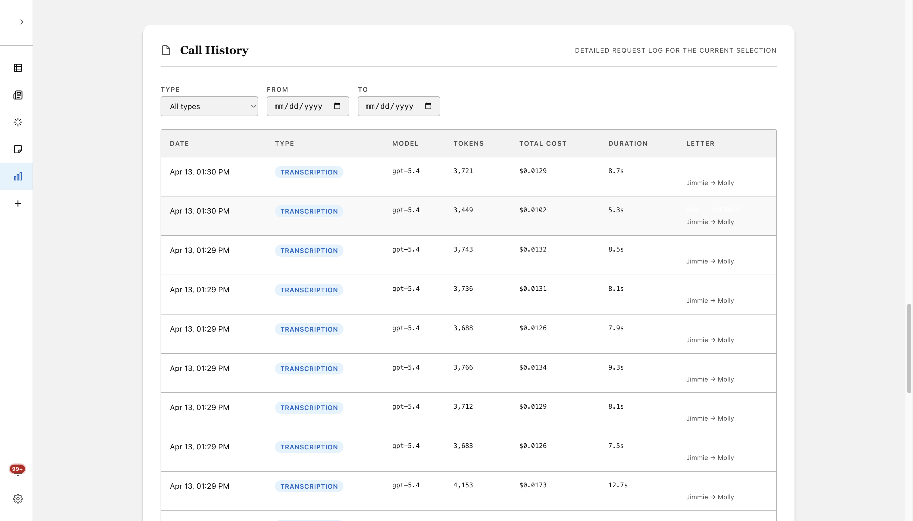

The same table the SQL aggregations roll up from. Every OpenAI request is one row: timestamp, type, model, token count, total cost, duration, and the letter it was attributed to. Date range and type filters let you narrow to "every transcription call in the last week" without writing SQL. Useful for catching outliers — a transcription call that took 30s instead of 8s, or used 12k tokens instead of the typical 3.5k, surfaces immediately. Backed by `GET /admin/usage/calls`.

### 5. Collection profiles — curation, not just metadata

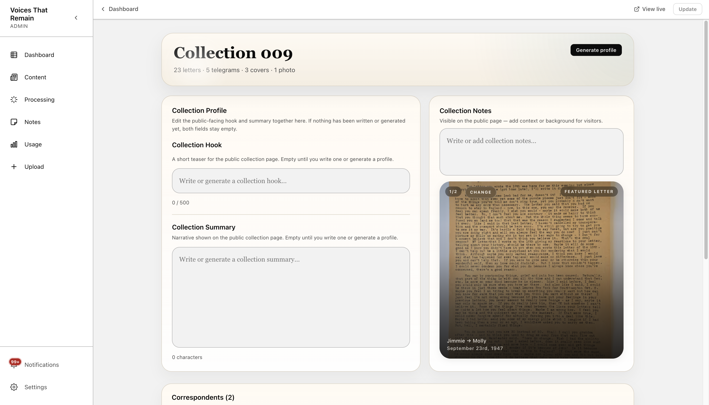

A _collection_ is the unit a visitor browses — typically one box of letters, one correspondent pair, one period. The collection editor is where the public-facing identity of that collection gets shaped.

- **Collection profile** — the long-form intro at the top of the public collection page. AI can draft this from the aggregated letter metadata once a few letters in the collection are verified, or the archivist can write it from scratch.
- **Collection hook** — a short teaser that shows up in collection cards on the homepage and elsewhere.
- **Collection summary** — middle-length, used in card hover states and SEO meta.
- **Featured letter** — the letter shown prominently on the collection page. The picker shows a thumbnail and identity strip so you can tell at a glance whether it's the right one.
- **Collection notes** — internal-only, never shown publicly. Used for provenance, rights, donor info, processing decisions.
- **Correspondents** — auto-derived from the letters in the collection but the editor lets you reorder or hide.

The `Generate profile` button at the top is the AI handoff: it bundles every verified letter's hook + summary + emotional tone, runs a single structured-output call against `COLLECTION_PROFILE_SYSTEM_PROMPT`, and writes the result into the three text fields as a draft for the archivist to refine. The response shape is fixed (`{ hook, narrative, correspondents[], isStub }`) and persisted to `collections.profileNarrative`, `profileCorrespondents`, and friends — so the next page render reads from the database, not from OpenAI. Code: [`backend/src/ai/generate-collection-profile.ts`](backend/src/ai/generate-collection-profile.ts), [`AdminCollectionPage.tsx`](frontend/src/pages/admin/AdminCollectionPage.tsx).

### 6. Block-based page editor — the rest of the site

Public pages — Homepage, About, Support, Contact — aren't hardcoded JSX. They're stored as JSON arrays of blocks, with nine section types: hero, richtext, cards, stats, steps, CTA, quote, two-column, contact. The same `BlockRenderer` component renders the public view and the admin preview, so what the archivist sees in the editor is exactly what visitors see.

#### Page-level navigation

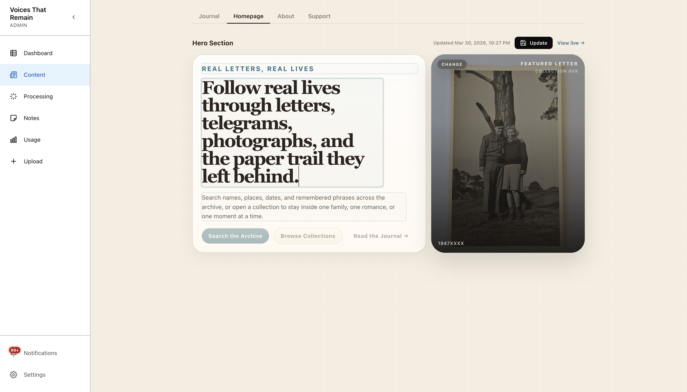

Every editable public page lives behind a single Content tab. The top nav (Journal · Homepage · About · Support) switches between pages without leaving the editor; the side rail switches between admin sections. The currently selected block (here, the **Hero** on the Homepage) renders inline and is editable in place — the featured letter image on the right is itself a block setting, so the archivist can swap which letter is featured without touching code. An `Update` button publishes; `View live` opens the public page in a new tab.

#### Multiple blocks per page

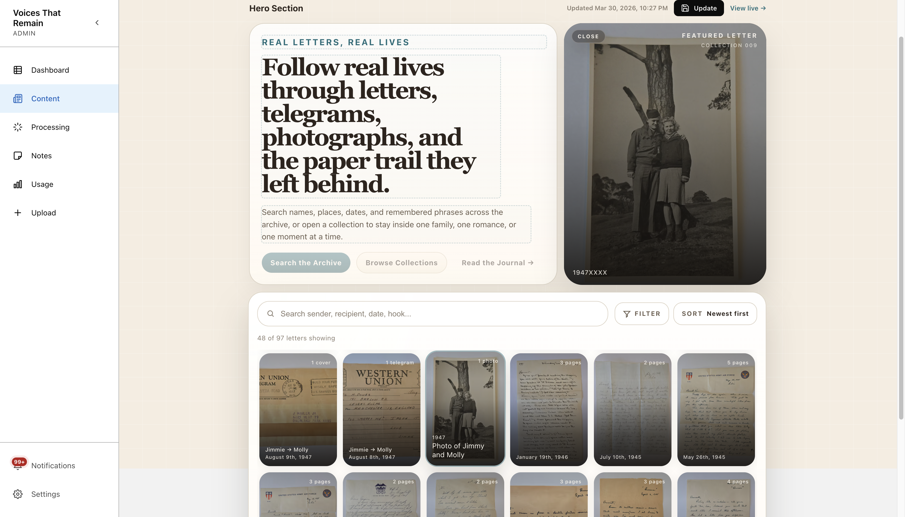

Scrolling down the same Homepage shows the **Letters Grid** block stacked under the hero — its own search, filter, sort, and a card grid of letters from the archive. The grid is a single block with its own schema (which collections to include, default sort, max items, whether to expose filters), and it lives next to the hero in the same JSON array. Reorder, add, or remove blocks and the public page reflects it.

#### Same system for narrative pages

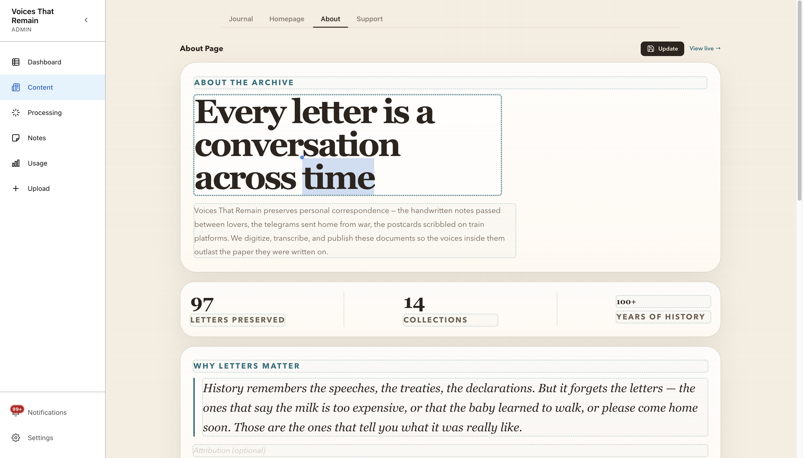

The About page uses the same renderer with different blocks — a hero with a different layout, a **stats** block ("97 letters preserved · 14 collections · 100+ years of history"), and a **quote** block ("Every letter is a conversation across time"). Each block has a typed schema, so adding a new section type is: define the schema, add a renderer, add an editor — and every existing page keeps working because old block types stay valid.

Block types are declared in [`frontend/src/content/blocks.ts`](frontend/src/content/blocks.ts) and constructed via [`blockFactories.ts`](frontend/src/content/blockFactories.ts); pages persist as JSONB in `content_pages.content_json`. The non-obvious bit is migration: when a block schema needs to change, a `resolveBlocks()` helper transforms the stored JSON on read so old pages keep rendering through schema evolution without a database backfill.

### 7. Upload — filename-driven ingest

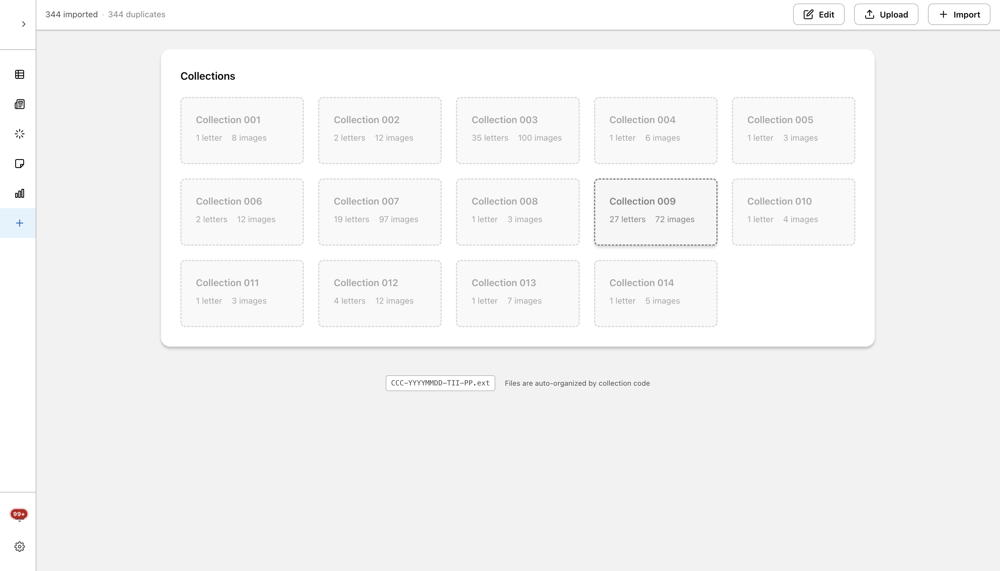

The whole ingest flow is built around the filename convention. The archivist drops a folder of scans (named `CCC-YYYYMMDD-TII-PP.ext` — collection / date / type+sequence / page) and the page parses every filename in the browser before sending anything to the backend. Files group by collection code, count up letters and images per collection, and render the cards above. Duplicate detection is filename-based: `checkDuplicates(filenames)` posts the list to the backend and receives a `{ filename: boolean }` map, matched against `letter_pages.originalFilename`. The "344 imported · 344 duplicates" header is computed client-side from that map — the duplicates banner here means every file in this batch was already imported once, which is the safe state when you re-drop the same folder.

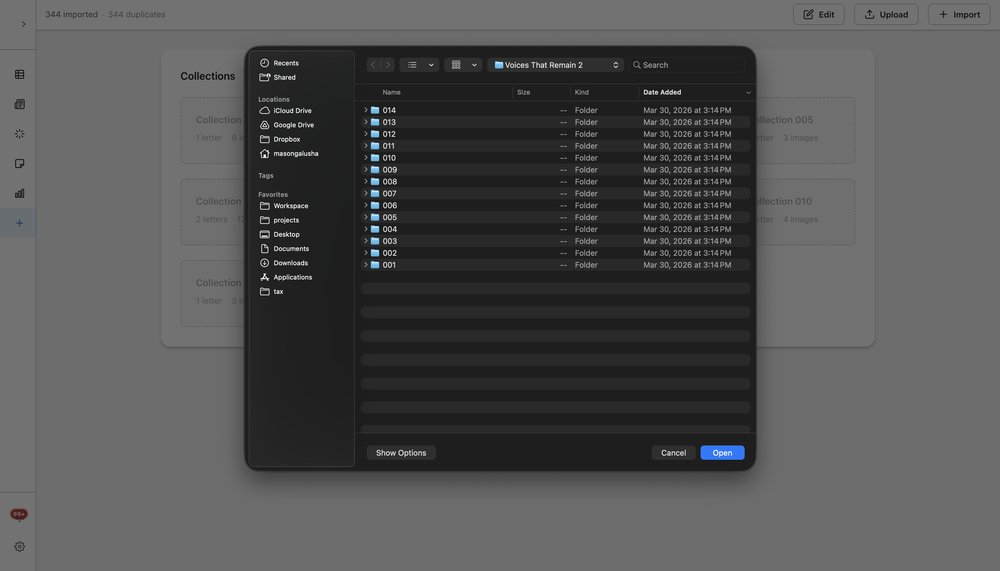

Picking files goes through the OS picker. The user can select a single collection folder (`009/`) or multiple folders at once (the screenshot shows folders 001 → 014 in the picker), and the page collapses everything into the per-collection cards regardless of nesting. Filenames that don't match the convention go into an "Uncategorized" carousel where you can rename them inline before commit. Code: [`UploadLetterPage.tsx`](frontend/src/pages/admin/UploadLetterPage.tsx), [`UploadLetter/utils.ts`](frontend/src/pages/admin/UploadLetter/utils.ts) (`groupImagesByCollection`), [`utils/filename-parser.ts`](frontend/src/utils/filename-parser.ts) — the client-side mirror of the backend parser at [`services/filename-parser.ts`](backend/src/services/filename-parser.ts), so the validation rules stay in one schema. Backend route: [`routes/admin/uploads.ts`](backend/src/routes/admin/uploads.ts).

### 8. Settings — admins, invites, and site config

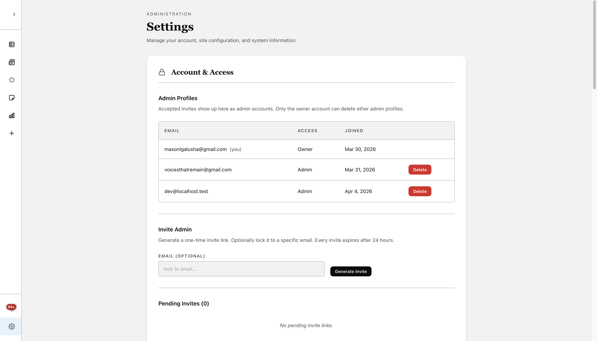

Three things live here. **Admin profiles** lists every account with access to `/admin`, who invited them, and when they joined; the owner account is protected from deletion. **Invite Admin** generates a one-time invite link the owner can share with a new admin — optionally locked to a specific email (so the link only works for that recipient) and expiring after 24 hours. **Pending Invites** shows links that haven't been redeemed yet. Stale invites are pruned automatically by [`cleanupStaleAdminInvites()`](backend/src/services/admin-invites.ts) and won't appear here once they've expired.

Below this section the Settings page also exposes site-wide values — public contact email, social links, theme tokens — stored as a flat `key/value` map in the `site_settings` table and edited through `PUT /admin/settings` with a `Record<string, string>` Zod schema. Admin accounts and invites live in `admin_users` and `admin_invites`; the join in the route at [`routes/admin/settings.ts:127`](backend/src/routes/admin/settings.ts) is what fills the "invited by" column. The 24-hour expiry comes from `ADMIN_INVITE_TTL_MS` in [`services/admin-invites.ts`](backend/src/services/admin-invites.ts). Auth is stateless JWT — issued at login, verified by middleware on every `/admin/*` route, no session table.

### Other admin surfaces (not pictured)

- **Notes** — Markdown / MDX editor for the public Journal (project updates, research notes, annotations on specific letters).
- **Notifications** — admin-side feed for "letter X failed metadata extraction 3 times", "entity Y has 12 unreviewed mentions", "monthly OpenAI spend exceeded budget", etc.

---

## Architecture

```
                ┌─────────────────────────────────────┐
                │        React + Vite Frontend        │
                │     Public UI · Admin Dashboard     │
                └──────────────────┬──────────────────┘
                                   │  REST + SSE
                                   ▼
                ┌─────────────────────────────────────┐
                │     Express Backend (TypeScript)    │ ─ ─ ─ ─ ─ ─ ─ ─ ┐
                │   Routes · Services · Auth · DTOs   │   triggers job  │
                └──────┬───────────────────────┬──────┘                 │
                       │                       │                        │
                       ▼                       ▼                        │
              ┌─────────────────┐     ┌─────────────────┐               │
              │   PostgreSQL    │     │  Shared Storage │               │
              │  Drizzle · CSQL │     │  scans + assets │               │
              │                 │     │  gcsfuse / FS   │               │
              └────────▲────────┘     └────────▲────────┘               │
                       │                       │                        │
                       │ jobs · pause          │ reads scans            │
                       │ flag · heartbeat      │ for vision             │
                       │                       │                        ▼
                ┌──────┴───────────────────────┴─────────────────────────┐
                │            Background Worker (Cloud Run Job)           │
                │   triggered on demand · drains queue · honors pause    │
                └──────────────────┬─────────────────────────────────────┘
                                   │
                                   ▼
                ┌─────────────────────────────────────┐
                │              OpenAI API             │
                │     Vision · Structured Outputs     │
                └─────────────────────────────────────┘
```

A few things worth knowing that the diagram glosses:

- **Storage is filesystem, not the GCS API.** In production the scan bucket is mounted into both the backend and worker containers via `gcsfuse` — see the volume mount in [`deploy/cloudrun/backend-worker-job.yaml`](deploy/cloudrun/backend-worker-job.yaml). In dev it's a local directory. Both processes call `getAbsoluteStoragePath()` and read files; nobody calls the GCS REST API directly.
- **Image serving goes through the backend, not direct GCS URLs.** `GET /images/:pageId` ([`routes/images.ts`](backend/src/routes/images.ts)) streams the file with on-the-fly Sharp resize keyed by a `?w=` query param, cached in an in-process LRU (max 1000 variants). No signed URLs.
- **The worker is a Cloud Run *Job*, fired on demand — not a long-running service, and not on a fixed schedule.** Admin actions (uploading letters, clicking "Process" on a letter, dispatching a batch from the processing dashboard) call `triggerWorkerJob()` in [`services/cloud-run-job.ts`](backend/src/services/cloud-run-job.ts), which hits `run.googleapis.com/v2/.../jobs/:run` to start a fresh execution. An active-heartbeat dedup prevents concurrent triggers from fanning out. The job runs with `EXIT_WHEN_EMPTY=true` ([`backend/src/worker.ts`](backend/src/worker.ts)): polls every 5 s in batches of 5 until the queue is empty, then exits. There's no always-on worker process to babysit.
- **Pause is DB-backed.** A singleton row in `worker_state` carries `isPaused` / `pausedAt` / `pausedReason` alongside the worker's heartbeat fields ([`services/worker-state.ts`](backend/src/services/worker-state.ts)). The worker reads the flag between stages (transcription → metadata → entity extraction) and between letters within a stage, but never mid-stage — the current call finishes and saves first. The pause moved to Postgres specifically so it could survive Job-mode container restarts; the previous in-memory flag was invisible to fresh executions. An admin "Process this letter" click can override pause via a `BYPASS_PAUSE=true` container override on that one job execution — set through the Cloud Run Jobs API's `containerOverrides`, not a global toggle.
- **Frontend ↔ Backend uses both REST and SSE.** REST for everything CRUD; a Server-Sent Events stream ([`useNotificationStream`](frontend/src/hooks/useNotificationStream.ts)) holds open for the admin notifications feed and live processing-dashboard updates.
- **One more external thing not shown:** a Python subprocess (`python/line_finder.py`) runs at upload time to compute per-line bounding boxes for the lightbox overlay. It's invoked by the backend, runs locally in the same container, and writes to `letter_pages.lineSegments` — so it's a sibling of "Backend" rather than a separate node.

The web tier never blocks on AI calls — it writes a job row to Postgres and (if no worker is currently running) fires a Cloud Run Job to drain it. Postgres is the broker for state — the actual queue rows, the pause flag, the worker's heartbeat — and the trigger is the side-channel that wakes the worker up.

## Tech Stack

| Layer            | Technology                                                   |
| ---------------- | ------------------------------------------------------------ |
| Frontend         | React 19, TypeScript, Vite, React Router                     |
| Rich Text        | TipTap (inline tag editor), MDXEditor (Journal posts)        |
| Data Viz         | D3 (relationship graph), Recharts (usage analytics)          |
| Backend          | Node.js, Express, TypeScript                                 |
| Database         | PostgreSQL 16, Drizzle ORM                                   |
| AI               | OpenAI (Vision + Structured Outputs)                         |
| Computer Vision  | Python subprocess — horizontal projection profiling          |
| Image Processing | Sharp (resize on serve, downscale before vision calls)       |
| Auth             | JWT + bcrypt                                                 |
| Validation       | Zod                                                          |
| Testing          | Vitest (unit), Playwright (E2E + accessibility via axe-core) |
| Deployment       | Google Cloud Run (services + Jobs), Cloud Build, gcsfuse     |

## Project Structure

```
voices-that-remain/
├── backend/src/
│   ├── routes/            # Express route handlers (public + admin)
│   │   └── admin/         # Admin API with letter, entity, collection management
│   ├── services/          # Business logic and external integrations
│   ├── pipeline/          # Processing workflows (transcription, metadata, entities)
│   ├── ai/                # OpenAI + Google Vision integration, prompt templates
│   ├── db/                # Drizzle schema (20 tables), migrations
│   ├── schemas/           # Zod request validation
│   ├── auth/              # JWT authentication
│   └── middleware/        # Error handling, rate limiting, validation
│
├── frontend/src/
│   ├── pages/             # Public pages + admin dashboard
│   ├── components/        # UI component library (common, search, viewers, editors)
│   ├── api/               # API client layer
│   ├── hooks/             # Custom React hooks
│   ├── contexts/          # React context providers
│   └── styles/            # CSS custom properties design system
│
├── e2e/                   # Playwright tests (live + mocked configurations)
├── deploy/cloudrun/       # Service + Job manifests (backend, frontend, worker, migrate)
└── scripts/               # Utility and verification scripts
```

## Database

20 tables across four domains:

- **Archive** — `collections`, `letters`, `letter_pages`, `letter_versions`, `letter_views`
- **Entities** — `canonical_persons`, `canonical_places`, `letter_persons`, `letter_places`, `person_relationships`, `entity_review_queue`
- **Content** — `update_posts`, `content_pages`, `site_settings`
- **Admin** — `admin_users`, `admin_invites`, `admin_notifications`, `audit_log`, `api_usage_logs`, `worker_state`

## Testing

- **Unit tests** — Vitest across both backend and frontend
- **E2E tests** — Playwright with two configurations: live (against running servers) and mocked (no database required, runs in CI)
- **Accessibility** — axe-core integration in E2E specs
- **CI** — Smoke E2E suite on pull requests; full suite available via manual dispatch

## Development

Monorepo with three packages — no root `package.json`. A `./dev` launcher starts both servers from any worktree:

```bash
./dev              # backend + frontend
./dev backend      # API only (port 3002)
./dev frontend     # Vite only (port 5174)
./dev --lan        # bind frontend to 0.0.0.0 for phone testing
```

For local AI-pipeline work, the worker runs in its own terminal: `cd backend && npm run worker`. Postgres runs natively on port 5432. A dev admin account (`dev@localhost.test` / `dev`) is auto-seeded in non-production environments.

| Task               | Command                                  |
| ------------------ | ---------------------------------------- |
| Run backend tests  | `cd backend && npm test`                 |
| Run frontend tests | `cd frontend && npm test`                |
| Run E2E tests      | `cd e2e && npx playwright test`          |
| Typecheck backend  | `cd backend && npm run typecheck`        |
| Generate migration | `cd backend && npm run drizzle:generate` |
| Apply migration    | `cd backend && npm run drizzle:migrate`  |
| Full verification  | `./scripts/verify-all.sh`                |

Without an `OPENAI_API_KEY`, the AI pipeline runs in stub mode with mock responses.

## License

MIT
