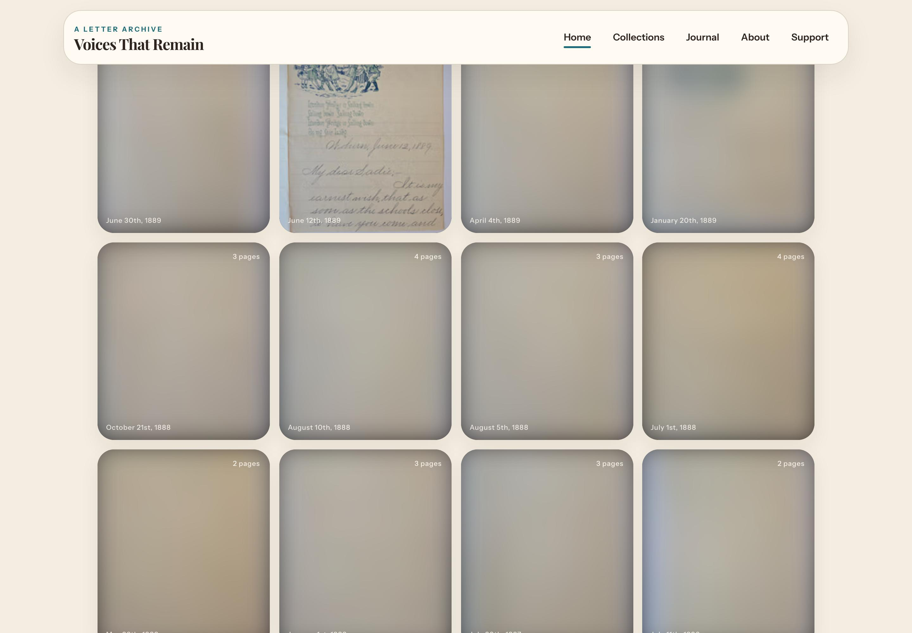
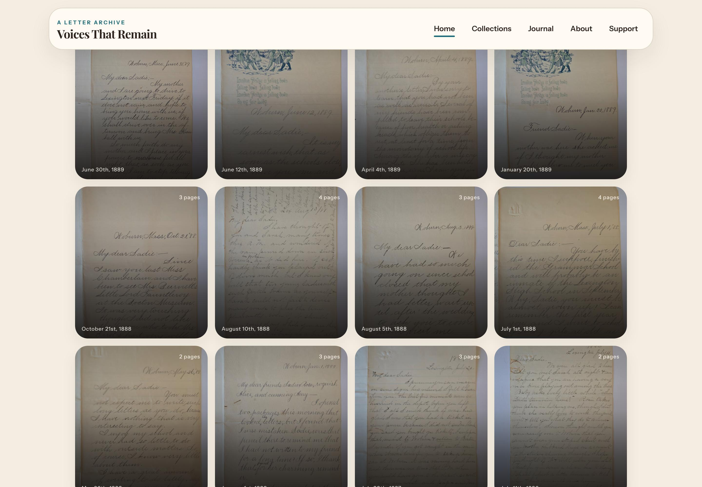

# Production image loading — measured before and after

Two focused changes reduce the work needed to browse the archive: each grid card loads one native 480-pixel image, and small result sets no longer fetch an 800-pixel reader image for every item. Final preview resolution, server encoding and publication revalidation remain the same. No cloud configuration or capacity changes were made.

[Open the visual comparison](report.html) · [Experiment log](experiment-log.md) · [Run the benchmark](../../scripts/image-perf-program.md)

## Latest release check — remaining delay

Efficiency improved, but consistent fast loading is not yet achieved. A later check of the final release stalled while new backend instances started; a repeat recovered but remained slower than the paired comparison below. Cloud request logs confirm multi-second server response times. Cold starts and per-instance image caches are plausible contributors, not a proven complete diagnosis.

Final deployed frontend: `d2c104725fa2215b16e536fec00ddce3682ca80e`. Same 4 Mbps / 80 ms fast-scroll method, one trial per viewport in each check.

| Check | Viewport | P95 readiness among completed images | Unresolved / observed scrolling images |
|---|---|---:|---:|
| First release check | mobile | 8351 ms | 20 / 50 |
| First release check | desktop | 8001 ms | 47 / 90 |
| Repeat | mobile | 2651 ms | 0 / 76 |
| Repeat | desktop | 2000 ms | 0 / 94 |

The first check ended with unresolved images; its P95 excludes those unfinished images and understates the overall wait. Its incomplete transfer totals are not efficiency savings. The repeat completed all previews at 90 mobile / 96 desktop image requests and approximately 2.35 / 2.47 MB, confirming the reduced workload. Completed requests in the first check waited a median 6.0 seconds (mobile) / 4.4 seconds (desktop) for response headers. Server logs independently recorded multi-second image requests and instance startups in the same interval. Do not interpret the earlier 400 ms desktop result as a consistent production service level. See [release observations](final-release-observations.json).

## Paired production comparison

Before frontend: `d3de8948c6e1ca10813f3cca8873ed9fb6cf2d3f`  
After frontend: `ec72790c8bbcb51020ef3d000bf80fb9ca555152`

The same production homepage was scrolled 16 times at 400 ms intervals, 65% of a viewport each time, on a simulated 4 Mbps download / 80 ms latency connection. Two fresh-browser trials per viewport, DPR 2. These runs use actual deployed assets and images, without candidate substitution.

| Viewport | Image requests | Image data transferred | P95 readiness after first entering view, per-run range |
|---|---:|---:|---:|
| desktop | 283 → 96 (66% fewer) | 3.28 → 2.47 MB (25% less) | 2452–3050 → 400 ms |
| mobile | 265 → 90 (66% fewer) | 3.12 → 2.35 MB (25% less) | 500–700 → 0 ms |

Request/data values are two-run means. P95 describes the slow end of the images observed in each run, not a real-user population percentile. Readiness includes the old loader's opacity fade. Images may finish after scrolling out of view. Zero means ready at the first 50 ms observation; it does not mean zero network latency. All scrolling images in these paired comparison trials resolved, with no page exceptions. The report generator also verifies that each paired run requested the exact same set of 480-pixel preview URLs; the saving comes from removing extra tiers, not omitting previews.

### Same scroll point, first desktop trial

Before:

After:

## Ordinary connection

The slower-paced native-connection comparison uses the original 800 ms scrolling interval. Many images already loaded before entering view in the baseline; the improvement is clearest in resource use and constrained fast scrolling.

| Scenario | Image requests | P95 readiness, per-run range |
|---|---:|---:|
| desktop / | 283 → 96 | 0–299 → 0 ms |
| desktop /collections/009 | 81 → 35 | 0–250 → 0 ms |
| mobile / | 265 → 90 | 202–548 → 0 ms |
| mobile /collections/009 | 81 → 35 | 0–451 → 0 ms |

## Repeat visits

On the ordinary connection, the second visit in the same browser context initiated 283 → 96 image requests and transferred 11,883 → 4,422 bytes. Browser caching already avoided most image data transfer before this work. Fewer preview requests reduce repeated checks; this is not a claim that repeat visits previously re-downloaded all the images. Returning within the same page is also covered by the browser regression.

## Architecture and scope

- Archive previews use one visible native image, one proximity observer and the existing 1200-pixel loading margin. Removed the 32/240/480 progression, detached image objects, second observer and final fade from these previews. Native loading continues to report image telemetry.
- Small result sets no longer preload every reader-sized scan. Collection 007's isolated experiment fell from 47 requests / roughly 1.5 MB to 30–31 requests / roughly 0.7 MB. A reversed control confirmed the resource difference. The deployed small-collection check confirmed 31 requests and 0.68–0.72 MB across the two viewports, with no unresolved previews. Its first cold-transform delay is not presented as a guaranteed speedup.
- Larger reading/zoom views retain progressive loading. The bounded collection/reader preloader and hover prefetch remain. No cache TTL relaxation, image resolution reduction, new service, migration, dependency or framework was required.
- A browser regression checks one preview size, distant-image deferral and reuse when scrolling back. The benchmark records raw image bytes/timing, per-image readiness, unresolved images and screenshots. Candidate experiments and production verification are kept separate.

## What remains uncertain

This is one Chromium browser on one machine, with two trials per condition. Server cache state and other traffic are uncontrolled; native and throttled results are not interchangeable. The initial baseline included a 4.58-second request. This work substantially reduces the bursts sent to the API, but cannot guarantee instantaneous loading after a backend cold start or on every connection. Existing CPU observations showed occasional near-capacity samples; no causal or billing estimate is inferred from those mixed-traffic samples. Any cloud capacity, caching service or storage changes require a separate discussion.

The report delivery also adds an elapsed-time guard to native image telemetry, so a missing Resource Timing entry in a long session cannot become a false zero-duration reading. That instrumentation change does not alter image sources, sizes or scheduling; the benchmark measures DOM readiness and network timing independently. Final release proof is attached to the report delivery PR.

The handwriting checkout remains outside this work. Raw evidence is stored as `results.json.gz` next to readable `summary.json` files; [the directory guide](README.md) explains each experiment. Release and final CI proof are recorded in the delivery section of that guide.
