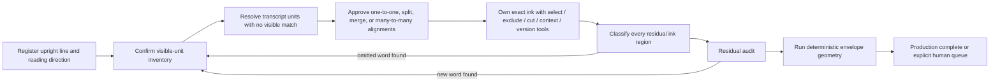

# Word-work supervisor v1

Status: isolated proof of concept. It changes no Letter Archive API, database,
frontend, or production worker.

## Outcome

The agent no longer decides where it is in the page or what to do next. Software
owns the cursor and emits one hash-bound work packet containing:

- the one current stage, line, and item;
- the complete line inventory and current transcript revision;
- the upright/source/claimed-ink evidence bindings;
- only the actions legal for that stage, with exact payload fields;
- the route each accepted action will take;
- the condition that finishes the item; and
- derived progress and blockers.

The model returns one small JSON action. Software rejects a wrong item, illegal
stage, stale revision, malformed payload, duplicate ownership, or impossible
state without moving the cursor.

## Workflow

The envelope is deliberately last. A good box/owned mask survives an envelope
failure, but a good-looking bubble can never certify the transcript, alignment,
or ink ownership.

## What closes the failures from the two-page run

### No silent skipped words

Every visible unit must belong to exactly one alignment group. A transcript unit
may temporarily lack a visible match, but that becomes an explicit
`alignment_gap` item rather than disappearing. Exhausting transcript tokens is
not a completion condition.

After ownership, every remaining ink region must be classified, converted into a
new visible word, or escalated. Converting a residual stores the exact source box,
tentative text, evidence hash, new visible-unit ID, and new alignment-group ID,
then sends the cursor back to location review.

### Rotated text has a direction, not just an angle

Semantic order uses a source-to-upright transform plus explicit start and end
anchors. It is separate from the undirected 90-degree morphology axis. This
preserves the Collection 014 order `We -> will`, `have -> a`, `big -> fat`, and
`New -> Years`, even where raw source Y coordinates suggest the reverse.

### Transcript mistakes are revisions

The immutable `source_text` is retained. A correction such as 007 `will -> wish`
increments the transcript revision, is replayable from history, invalidates the
current and later alignment/ownership/envelope state, and returns the same visible
ink as the next item. A rehashed text change with no correction event is rejected.

### Human review cannot masquerade as completion

Human escalation requires a reason and evidence hash. It is terminal for the
machine pass, but remains a production blocker. Location escalation cascades to
dependent alignment, ownership, and envelope state. Residual or semantic review
blocks line envelope generation; independent inventory work can continue.

### Corrupt or stale state fails closed

Validation derives completion from the canonical inventory. It rejects duplicate
IDs/orders, dangling references, reused visible/transcript units, approval without
evidence, group approval before its locations, missing human-queue records,
transcript/history drift, stale decisions, and duplicate committed mask hashes.

## Ownership tool loop beneath one supervisor item

The existing bounded ownership workflow remains responsible for the hard visual
work. For the current alignment group it can:

1. show a larger upright line crop, source locator, numbered components, and all
   previously owned ink in red;
2. select the ink to keep or exclude whole foreign components;
3. make a narrow cut through a shared component, then regenerate components;
4. request more context without advancing the word;
5. compare immutable before/after candidate versions and choose one; or
6. defer unsafe shared ink to a human.

Only the chosen mask and selection-record hashes can become
`approve_ownership`. Nonterminal cleanup turns leave the supervisor on the same
word/group.

## Current evidence

- The complete POC suite passes: **136 tests**.
- The deterministic 007/014 workflow package rebuilds byte-identically with
  package hash `7277cbb38ad4d7a0e13b3b75fc07b4925f1899ff99dcf92745493f383d1b6e0f`.
- A fresh Terra agent was shown only the prompt and current packets, not the
  scripted answers. It made the intended action on all four scenarios, used
  packet-bound evidence on all four, and every decision passed strict replay.
  Validation hash:
  `15fbb221204b1413edd5764685df4cba8801bac30614b78402cd30bffd0909f0`.

Those four trials validate navigation and contract-following, not visual accuracy.
The demo boxes and image/evidence hashes are deterministic simulations tied to the
real 007/014 page identities. No claim of 99.9% word accuracy is made.

## Provisional model routing

- **Software:** page/line cursor, order, transforms, hashes, component operations,
  overlap checks, residual coverage, rollback bindings, and envelope geometry.
- **Terra first:** routine registration, location confirmation, obvious alignment,
  obvious residual classification, and low-risk reversible cleanup.
- **Upgrade to Sol:** shared/touching components, vertical or sideways text,
  fragmented words, transcript conflict, fold interference, and candidate
  disagreement.
- **Human:** unsafe cuts, clipped/unreadable words, unresolved model disagreement,
  and any semantic ownership that lacks independent acceptance evidence.

Sol is an escalation model, not an oracle. Earlier ownership experiments contain
unsafe confident decisions from both Terra and Sol, so model confidence alone must
never unlock production completion.

## Remaining work before another full-page run

1. Build real supervisor packets from the actual 007/014 line proposals, source
   crops, transcripts, and residual masks. The current four-scenario package tests
   state semantics with simulated visual evidence.
2. Connect the line-wide claimed-ink raster to every ownership commit so partial
   pixel overlap—not only an identical mask hash—is rejected across groups.
3. Add a supervisor-level request/fulfil-context handshake for registration,
   location, alignment, and residual stages; ownership already has bounded context
   expansion.
4. Persist revisions atomically under external genesis/hash custody, then add
   explicit append-only rollback, crash resume, and human-resolution transitions.
   The current unkeyed self-hashes detect accidental drift and stale replay; they
   are not authentication against an actor who can rewrite the entire ledger.
5. Let software preallocate insertion IDs and rebalance reading ordinals so the
   agent never has to invent bookkeeping fields when it discovers a word.
6. Rerun the two pages with an independent observer recording time, tool turns,
   context requests, corrections, escalations, and every rejected transition.

The next useful experiment is therefore not another free-form “box every word”
prompt. It is a real packet-builder integration followed by the same two pages
through this supervisor.
